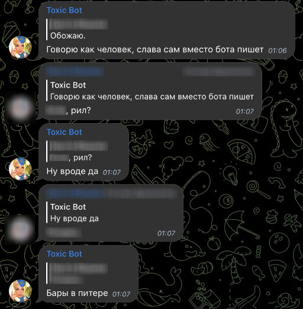

# Toxic Bot

Toxic Bot is a Telegram bot.

It was made mostly for my own amusement, so it's not really useful
for anyone else.

## Main features

### Random replies

It uses Markov chain algorithm to generate a random reply when someone 
mentions the bot, or when it feels and urge to join the conversation with
its dumb phrases.

### Jokes

The bot can send a low-quality anecdote in response to /joke command.
It also sends them each midnight Moscow time to each chat it was added.

### Music links converting

If the bot detects a link to music in some music streaming service, it searches
for it in other streaming services and sends them in response.

### Adding songs to Spotify queue

When I have a party with my friends, they can send music links to one of 
our group chats, so I could add these songs to my Spotify queue.

Sounds stupid, and it is.

### Tarot cards divination

### Emojification

Just decorate the message with emojis in 
[r/emojipasta](https://www.reddit.com/r/emojipasta/) style.

It tries to fit emojis by their meaning, but does not make this very well.

## License

[MIT](https://choosealicense.com/licenses/mit/)
