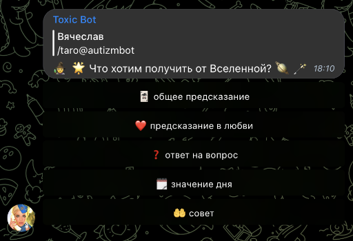

# Toxic Bot

Toxic Bot is a Telegram bot.

It was made mostly for my own amusement, so it's not really useful
for anyone else.


## Main features

### Random replies

It uses Markov chain algorithm to generate a random reply when someone 
mentions the bot, or when it feels an urge to join the conversation with
its dumb phrases.

<p align="center"></p>


### Jokes

The bot can send a low-quality anecdote in response to /joke command.
It also sends them each midnight Moscow time to each chat it was added.

<p align="center"></p>


### Music links converting

If the bot detects a link to music in some music streaming service, it searches
for it in other streaming services and sends them in response.

<p align="center"></p>


### Tarot cards divination

<p align="center"></p>
<p align="center"></p>
<p align="center"></p>


### Emojification

Just decorate the message with emojis in 
[r/emojipasta](https://www.reddit.com/r/emojipasta/) style.

It tries to fit emojis by their meaning, but does not make this very well.

<p align="center"></p>


### Installation

```shell
mkdir -p ~/deployments/toxic
chmod 0755 ~/deployments/toxic

sudo -u postgres createuser toxic -P
sudo -u postgres createdb -O toxic toxic

inv deploy -t=user@host
```


## License

[MIT](https://choosealicense.com/licenses/mit/)
